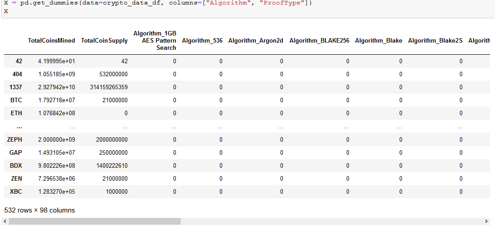
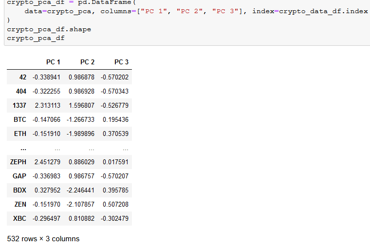
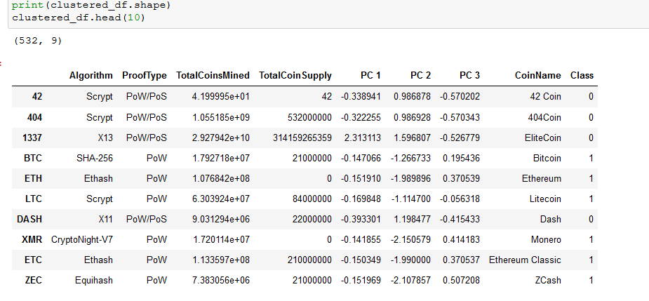
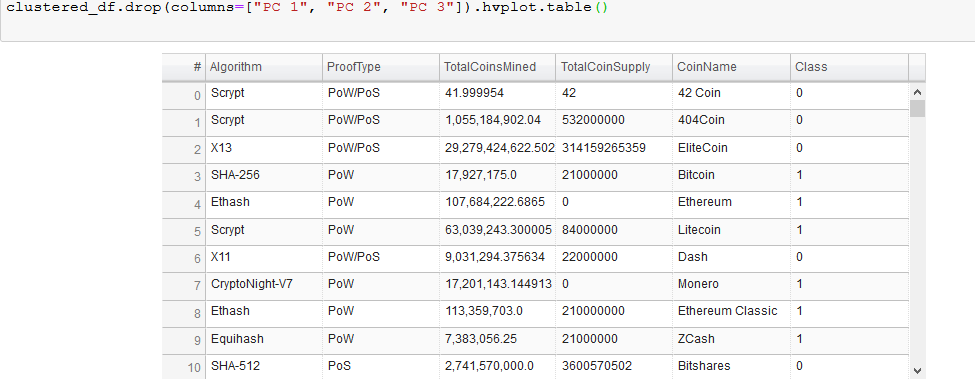
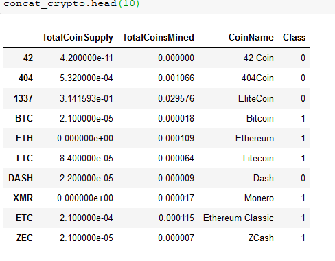
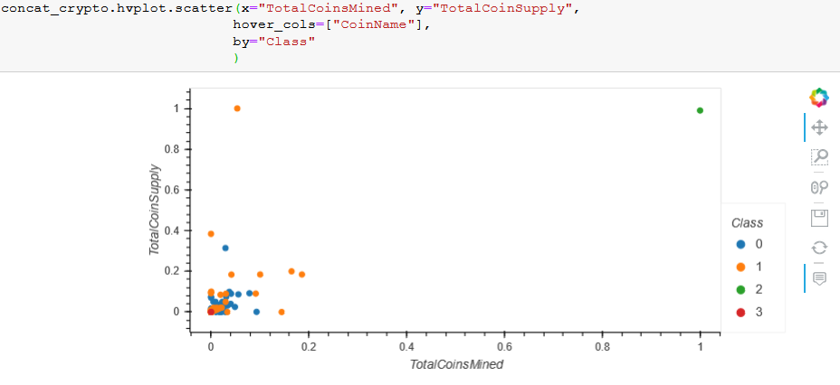

# Cryptocurrencies

## *Accountability Accounting Now Offers Cryptocurrency Investments!*

By using a clustering algorithm, Martha from the Advisory Services Team and I have used machine learning models to create
a new classification system for cryptocurrencies here at Accountability Accounting. 

Data is preprocessed for PCA, dimensions are reduced with PCA, K-means is used to cluster, and Cryptocurrencies are
visualized into charts and graphs. 

###  * Cleaning Cryptocurrency Data with get_dummies and fit_transform

### * Reduce dimensions into three principal components

### * K-means algorithm clusters PCA data with hvPlot

### * Cryptocurrency Data Visualized 

